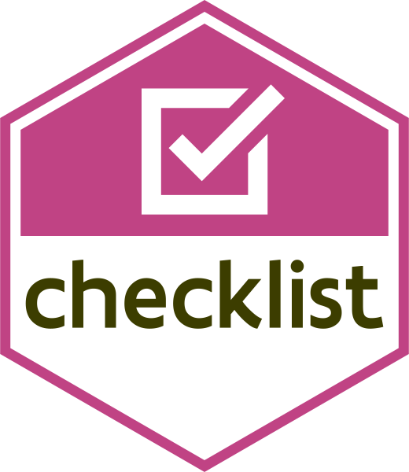

# The Checklist Package 
 
<!-- README.md is generated from README.Rmd. Please edit that file -->

[](https://www.repostatus.org/#wip)
[](https://lifecycle.r-lib.org/articles/stages.html#experimental-1)

[](https://github.com/inbo/checklist/actions)
[](https://codecov.io/gh/inbo/checklist?branch=master)


[](https://doi.org/10.5281/zenodo.4028303)

```{r setup, include = FALSE}
knitr::opts_chunk$set(
  collapse = TRUE,
  comment = "#>",
  fig.path = "man/figures/README-",
  out.width = "100%"
)
```

The goal of `checklist` is to provide an elaborate and strict set of checks for R packages and R code.

## Installation

You can install the development version from [GitHub](https://github.com/) with:

```{r installation, eval = FALSE}
# install.packages("remotes")
remotes::install_github("inbo/checklist")
```

## Examples

You can run the full list of checks

```{r example-full, eval = FALSE}
library(checklist)
check_package() # for packages
check_source() # for a project with R and Rmd files
```

Or run the individual checks

```{r example-detail, eval = FALSE}
check_cran()
check_description()
check_documentation()
check_lintr()
check_filename()
```

Create a `checklist.yml` to allow some of warnings or notes.

```{r example-checklist, eval = FALSE}
write_checklist()
```

Start a package from scratch with everything set-up

```{r example-create, eval = FALSE}
create_package()
```
